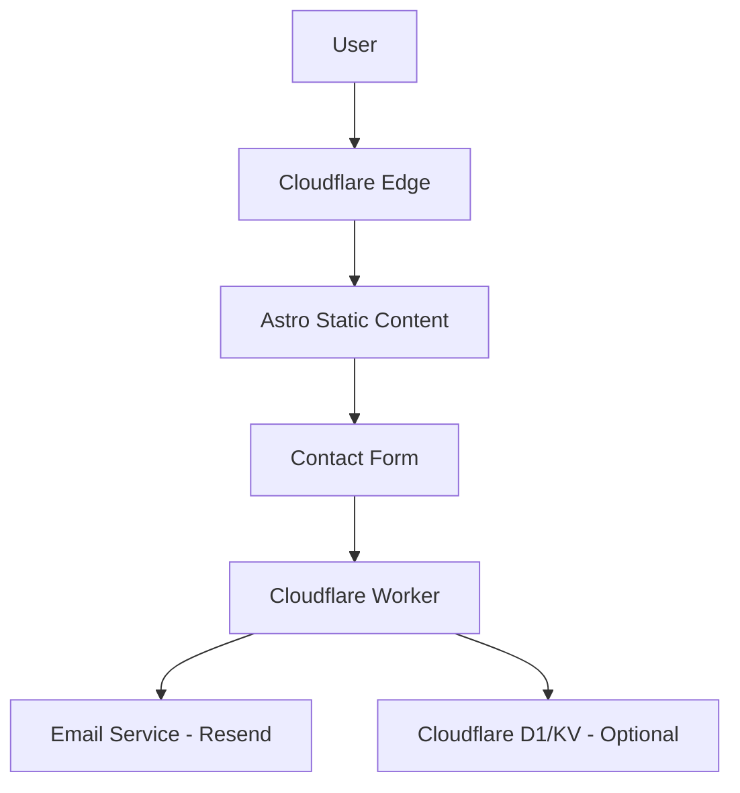

# Project Plan: SEOSERVICESMIAMI.COM

## 1. Objective
Create a high-performance, modern one-page website for an SEO agency in Miami, optimized for Cloudflare.

## 2. Proposed Structure (Sections)
1.  **Hero**: High-impact headline + CTA (Free Audit).
2.  **Trust Bar**: Client logos/Certifications.
3.  **Services**: Grid of SEO services (Local, Technical, Content, Links).
4.  **The Miami Advantage**: Why local expertise matters.
5.  **Our Process**: Step-by-step workflow.
6.  **Results/Case Studies**: Data-driven success stories.
7.  **Testimonials**: Client feedback.
8.  **FAQ**: Addressing common objections.
9.  **Contact/Lead Gen**: Simple form + contact info.
10. **Footer**: Social links, legal.

## 3. Technology Stack
- **Framework**: [Astro](https://astro.build) (v4+) - Using Static Site Generation (SSG) for near-instant load times.
- **Styling**: [Tailwind CSS](https://tailwindcss.com) - Utility-first CSS for a modern, responsive UI.
- **Icons**: [Lucide React](https://lucide.dev) - Clean, consistent iconography.
- **Animations**: [Framer Motion](https://www.framer.com/motion/) - For smooth scroll reveals and interactive hover states.
- **Deployment**: [Cloudflare Pages](https://pages.cloudflare.com/) - Deployed to the edge for global performance.
- **Backend**: [Cloudflare Workers](https://workers.cloudflare.com/) - Serverless functions to handle contact form submissions.
- **Email**: [Resend](https://resend.com) - Reliable email delivery for lead notifications.
- **Performance**: Target 100/100 on all Lighthouse metrics (Performance, Accessibility, Best Practices, SEO).

## 4. Design Concept & UI/UX Improvements
- **Theme**: **Premium Dark Mode** with "Miami Nights" accents. Use deep navy/charcoal backgrounds with vibrant neon cyan and electric purple gradients.
- **UI Style**: **Glassmorphism**. Use semi-transparent cards with `backdrop-blur` and subtle borders to create depth.
- **Typography**:
    - Headings: **Clash Display** or **Syne** (Modern, high-end feel).
    - Body: **Inter** (Highly readable).
- **Interactivity Enhancements**:
    - **Interactive ROI Calculator**: A simple widget to estimate potential revenue growth from SEO.
    - **Before/After Slider**: Visualizing search result improvements for a case study.
    - **Magnetic Buttons**: Subtle magnetic pull effect on primary CTAs.
    - **Scroll Progress Indicator**: A thin neon line at the top of the page.
- **Local Authority**: Interactive map highlighting Miami neighborhoods (Wynwood, Brickell, Coral Gables) to reinforce local expertise.

## 5. Conceptual Layout (Wireframe)
- **Header**: Sticky, transparent-to-solid on scroll. Logo (Left), Nav Links (Center), "Free Audit" CTA (Right).
- **Hero**: Split layout or centered. Large bold H1, subtext, and a prominent primary button.
- **Services**: 2x2 or 4x1 grid of cards with hover lift effects and subtle borders.
- **Process**: Vertical or horizontal stepper with icons and connecting lines.
- **Testimonials**: Single-item carousel or a 3-column masonry grid.
- **Contact**: Two-column layout. Left: "Let's Talk" text + contact info. Right: Clean, minimal form.

## 6. Advanced SEO & Performance Strategy
- **Full Strategy**: See [`plans/seo_strategy.md`](plans/seo_strategy.md) for the deep-dive.
- **Schema Markup**: Implementation of `ProfessionalService`, `Service`, `FAQPage`, and `Review` JSON-LD.
- **Core Web Vitals**:
    - Image optimization via Astro's `<Image />` component (WebP/AVIF).
    - Critical CSS inlining and font preloading.
- **Local Relevance**: Neighborhood-specific content blocks and local entity linking.
- **Bilingual SEO**: Hreflang-ready structure for English/Spanish search dominance.

## 7. Mermaid Diagram (Workflow)

